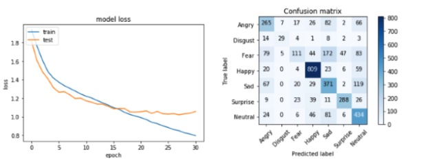
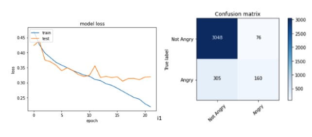
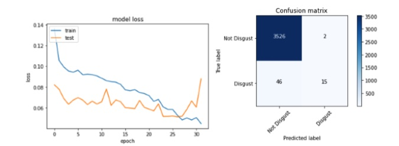
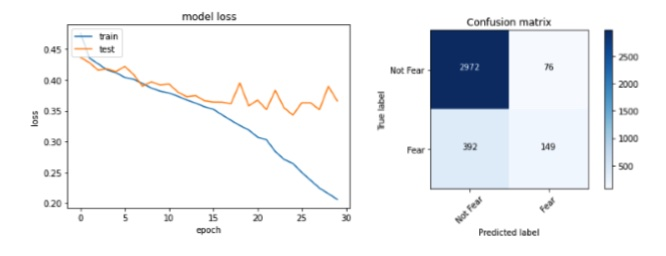
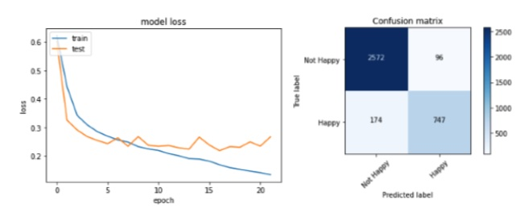
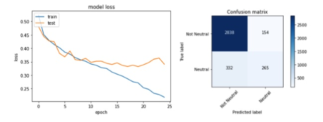
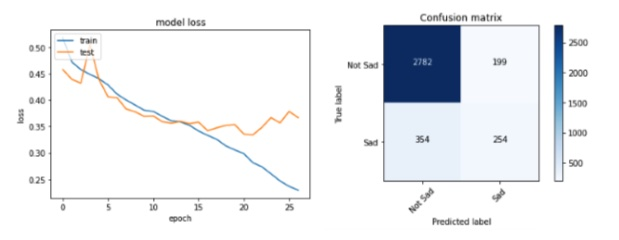
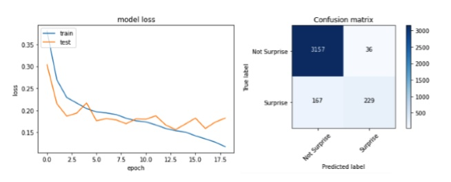

# Third Year Project Code (2019/2020)

# Introduction
This repo uses a Convolutional Neural Network to classify seven emotions: 
Anger, Disgust, Fear, Happy, Sad, Surprise, Neutral. Alongside multiple Binary Classifers that classify one of the seven emotions, for example: Angry or not, Happy or not etc.

This program leverages the CNN model implemented by Keras whilst running on top of TensorFlow.

# Getting started

To run these files, make sure the following environment and libraries are up to date:
1) Python
2) TensorFlow
3) Keras
4) Numpy
5) Pandas
6) sklearn

# File Contents

The project was done using Kaggle IDE, to take advantage of google's GPUs.

The dataset folder contains the main dataset 'ferdataset' and also the code to 
convert the dataset into the multiple binary datasets required for the project.

The multiclass classifer consists of three files:

1) preprocessing.ipynb
2) creating-cnn.ipynb
3) testing-saved-cnn-model.ipynb

The binary classifiers consist of the same file structure e.g angry_binary_classifier:

1) preprocessing-angry.ipynb
2) creating-cnn-angry.ipynb
3) testing-angry-cnn.ipynb

# Results

Results are shown through confusion matrices at the end of testing, alongside the graph of training the model.

Multiclass classifier - 64% accuracy:

Binary 'Anger' classifier - 34.4% accuracy:

Binary 'Disgust' classifier - 24.59% accuracy:

Binary 'Fear' classifier - 27.5% accuracy:

Binary 'Happy' classifier - 81.11% accuracy:

Binary 'Neutral' classifier - 44.31% accuracy:

Binary 'Sad' classifier - 41.45% accuracy:

Binary 'Surprise' classifier - 57.83% accuracy:

